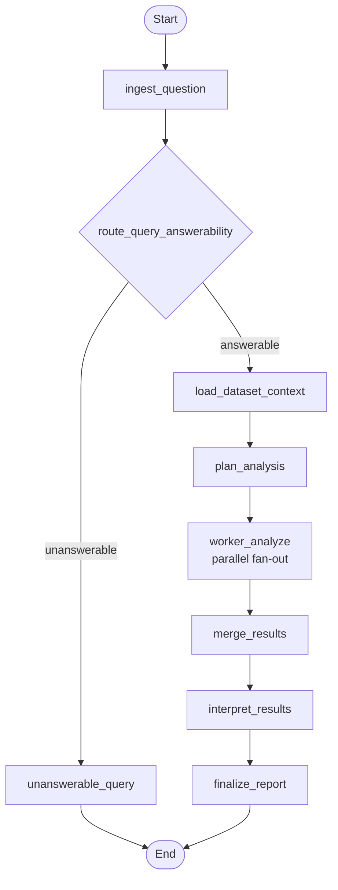

# Data analysis agent

This package implements a **LangGraph** agent that answers natural-language questions over the local ShareChat parquet dataset (`data/dataset.parquet`). It first checks whether a query is answerable from dataset-only context, then runs an LLM-planned, multi-step analysis pipeline with parallel worker tasks, merges structured outputs, and produces an LLM-grounded interpretation.

The graph is defined in `agent.py`; the Typer CLI lives in `main.py`.

## Nodes

| Node | Purpose |
| ---- | ------- |
| **ingest_question** | Normalizes the incoming `user_query` into `analysis_goal`. |
| **route_query_answerability** | Calls an OpenAI model with structured boolean output (`answerable`) using the full dataset description context from `data/DATASET_DESCRIPTION.md`, then routes to `answerable` or `unanswerable`. |
| **unanswerable_query** | Emits the required fallback line: `this query can't be answered by the data`, then exits the graph. |
| **load_dataset_context** | Loads local parquet via `DataLoader.load_data_from_local`, then builds compact schema/profile context (columns, dtypes, null fractions, sample values, derived-feature hints). |
| **plan_analysis** | Uses structured LLM output to create a bounded subtask plan (1-3 subtasks) with explicit operations and columns. |
| **worker_analyze** | Runs one planned subtask on pandas data (parallel fan-out branches), producing structured per-worker results. |
| **merge_results** | Combines all worker outputs into one stable merged object for downstream interpretation. |
| **interpret_results** | Uses structured LLM output to generate key findings, caveats, and short interpretation text grounded in merged numeric/categorical results. |
| **finalize_report** | Assembles and prints final report text with the query goal, merged structured outputs, and narrative interpretation. |

## How the nodes relate



## How to run

From the **repository root**:

```bash
PYTHONPATH=. uv run python agents/data_analysis/main.py --user-query "your analysis question"
```

Equivalent module form:

```bash
PYTHONPATH=. uv run python -m agents.data_analysis.main --user-query "your analysis question"
```

Unanswerable example:

```bash
PYTHONPATH=. uv run python agents/data_analysis/main.py --user-query "what is the weather next week"
```

## Configuration and dependencies

- **Environment**: CLI and agent module load the repo-root `.env` through `lib.env_vars_loader`.
- **Required key**: `OPENAI_API_KEY` for `ChatOpenAI` (routing, planning, interpretation).
- **Data source**: local parquet loaded by `data/dataloader.py` (`data/dataset.parquet` by default).
- **Graph image**: `visualization.png` in this folder can be generated via the graph visualization helper in `agent.py`.
