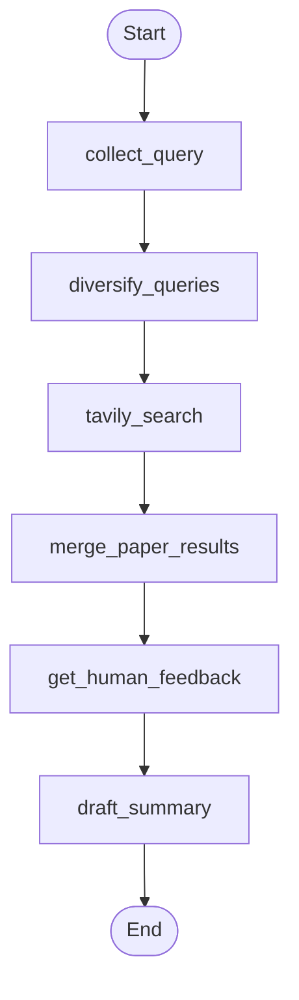

# Literature review agent

This package implements a **LangGraph** agent that helps social-science and interdisciplinary researchers **discover web literature** from a single research question. It diversifies the question into several search queries, runs **Tavily** searches in parallel, merges and deduplicates hits, pauses for **human curation**, then asks an LLM to draft a structured **markdown report** grounded on the remaining sources.

The graph is defined in `agent.py`; the Typer CLI lives in `main.py`. Successful runs write `report.md` in this directory (`agents/lit_review/report.md`).

## Nodes

| Node | Purpose |
|------|--------|
| **collect_query** | Ensures a non-empty research `query` is set, using the CLI value or an interactive prompt if none was passed. |
| **diversify_queries** | Calls an OpenAI chat model with structured output to rewrite the query into **N** distinct web search strings improving recall across angles and terminology. |
| **tavily_search** | Loads MCP tools (Tavily over stdio), runs one search per worker payload (`worker_query`), and appends normalized hits into shared state for downstream merging. |
| **merge_paper_results** | Consumes all `tavily_raw_hits` from parallel branches, deduplicates by URL, and builds the human-readable `papers` list (title, URL, optional source-query suffix). |
| **get_human_feedback** | Interactive checkpoint: lists merged sources, lets you remove entries by index, optionally records free-text guidance; updates `papers` and `human_feedback` for the summary step. |
| **draft_summary** | Invokes the LLM with the curated list (and human notes) to produce a markdown report.|

## How the nodes relate



## How to run

From the **repository root** (so `PYTHONPATH` includes the package):

```bash
PYTHONPATH=. uv run python main.py --query "your research question"
```

Omit `--query` / `-q` to be prompted for the question interactively.

**Module entrypoint** (equivalent):

```bash
PYTHONPATH=. uv run python -m agents.lit_review.main --query "your research question"
```

**Graph image** (requires dependencies such as those used by LangGraph’s Mermaid PNG export):

```bash
PYTHONPATH=. uv run python main.py --visualize
```

Saves `agents/lit_review/visualization.png` and prints a fallback ASCII graph if PNG generation fails.

## Configuration and dependencies

- **Environment**: The CLI loads the repo-root `.env` via `lib.env_vars_loader` before the graph runs. Set **`OPENAI_API_KEY`** for `ChatOpenAI` (used in diversify and draft steps). Set **`TAVILY_API_KEY`** for Tavily; the MCP client runs `npx -y tavily-mcp@latest` with that key (see `mcp.py`).
- **Node.js / `npx`**: Required on `PATH` so the Tavily MCP server can start.
- **Outputs**: `report.md` in this folder after **draft_summary**; optional `visualization.png` when using `--visualize`.
