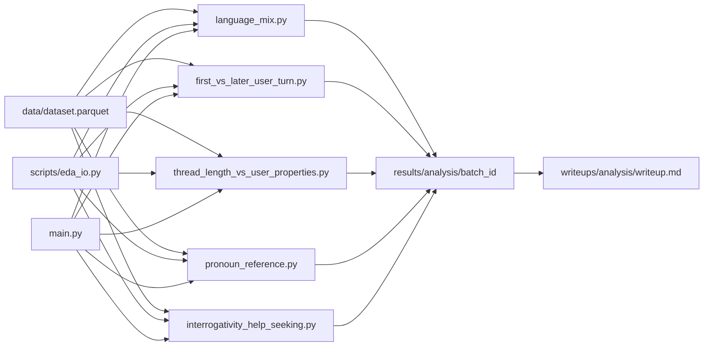

# ShareChat initial EDA — implementation plan

## Remember

- Exact file paths always
- Exact commands with expected output
- DRY, YAGNI, TDD, frequent commits
- Maximum safely delegable parallelism
- Delegated tasks must be impossible to misread
- No changes under `ui/`; browser before/after screenshots from planning rules **do not apply** (matplotlib outputs only)

## Overview

This work implements the five exploratory analyses described in [experiments/initial_eda_2026_05_04/README.md](experiments/initial_eda_2026_05_04/README.md) against ShareChat data loaded locally as Parquet via [data/dataloader.py](data/dataloader.py) (default: `data/dataset.parquet`, `chatgpt` config slice). Each analysis is a standalone script that writes a **batch-timestamped** directory containing **`results.json`** and at least one **matplotlib** image (default name `visuals.png`, or multiple files listed in JSON). [experiments/initial_eda_2026_05_04/scripts/main.py](experiments/initial_eda_2026_05_04/scripts/main.py) runs all five analyses **in parallel processes**. After a successful batch, **writeups** are produced under `experiments/initial_eda_2026_05_04/writeups/{analysis}/writeup.md` by reading the **latest** `results/{analysis}/*/results.json` and the associated figure paths. Plan assets for this workflow should be saved under `docs/plans/2026-05-04_sharechat_initial_eda_482391/` (copy this plan there when implementing).

## Happy Flow

1. Engineer ensures [data/dataset.parquet](data/dataset.parquet) exists (run `uv run python data/dataloader.py` from repo root if needed).
2. **Serial spine** adds shared helpers in [experiments/initial_eda_2026_05_04/scripts/eda_io.py](experiments/initial_eda_2026_05_04/scripts/eda_io.py): repo-root resolution, default Parquet path, `make_run_dir(analysis_slug, batch_id)`, JSON writer, `matplotlib` `Agg` setup, optional `topic` column detection.
3. **Parallel** (five Cursor subagents / five task packets): each implements exactly **one** of `language_mix.py`, `first_vs_later_user_turn.py`, `thread_length_vs_user_properties.py`, `pronoun_reference.py`, `interrogativity_help_seeking.py` — each imports `eda_io`, loads Parquet with pandas, filters `role == "user"` where the question demands user text, computes aggregates, saves figures + `results.json` under `experiments/initial_eda_2026_05_04/results/{analysis}/{batch_id}/`.
4. **Serial integration**: implement [experiments/initial_eda_2026_05_04/scripts/main.py](experiments/initial_eda_2026_05_04/scripts/main.py) to generate one UTC `batch_id` (e.g. `20260504T153022Z`), pass it to each script via CLI (`--batch-id`) or environment (`SHARECHAT_EDA_BATCH_ID`), run five subprocesses with `concurrent.futures.ProcessPoolExecutor`, collect exit codes, print paths to each `results.json`.
5. **Serial writeups**: add [experiments/initial_eda_2026_05_04/scripts/generate_writeups.py](experiments/initial_eda_2026_05_04/scripts/generate_writeups.py) (or extend `main.py` with `--writeups`) that for each of the five `analysis` slugs picks the lexicographically greatest or newest mtime child under `results/{analysis}/`, reads JSON, copies relative links to PNGs, writes [experiments/initial_eda_2026_05_04/writeups/{analysis}/writeup.md](experiments/initial_eda_2026_05_04/writeups/language_mix/writeup.md) (one folder per analysis).

## Serial Coordination Spine

1. Verify/add runtime deps: `pandas`, `matplotlib`, and `scipy` (for Spearman in analysis 3). Confirm with `uv add pandas matplotlib scipy` if `uv run python -c "import pandas, matplotlib, scipy"` fails.
2. Create directory skeleton: `experiments/initial_eda_2026_05_04/scripts/`, `experiments/initial_eda_2026_05_04/results/`, `experiments/initial_eda_2026_05_04/writeups/` (gitkeep optional).
3. Implement **only** [experiments/initial_eda_2026_05_04/scripts/eda_io.py](experiments/initial_eda_2026_05_04/scripts/eda_io.py) and freeze the output contract (constants for JSON keys, required top-level fields).
4. After five analysis files exist, implement [experiments/initial_eda_2026_05_04/scripts/main.py](experiments/initial_eda_2026_05_04/scripts/main.py).
5. Run full batch locally; fix failures.
6. Implement writeup generator and run it once per analysis.
7. Copy this plan into `docs/plans/2026-05-04_sharechat_initial_eda_482391/plan.md` (no `ui/` screenshots).

## Interface or Contract Freeze

**Analysis slugs (folder names under `results/` and `writeups/`):**

- `language_mix`
- `first_vs_later_user_turn`
- `thread_length_vs_user_properties`
- `pronoun_reference`
- `interrogativity_help_seeking`

**Output directory:** `experiments/initial_eda_2026_05_04/results/{analysis_slug}/{batch_id}/`

**Required artifacts:**

- `results.json` — UTF-8 JSON object with at minimum:
  - `schema_version` (string, e.g. `"1.0"`)
  - `analysis` (string, slug above)
  - `batch_id` (string, matches parent folder)
  - `dataset_path` (string, absolute or repo-relative)
  - `row_count_input`, `row_count_after_filters` (integers)
  - `filters` (object, e.g. `{"role": "user"}`)
  - `figures` (array of strings, relative filenames under same folder, e.g. `["visuals.png"]`)
  - `metrics` (object or array — all numeric summaries used for the writeup)
  - `warnings` (array of strings; e.g. missing `topic` column)
- At least one PNG file referenced in `figures` (default `visuals.png`).

**CLI contract (each analysis script):**

- `--parquet` default: resolve from repo root to `data/dataset.parquet`
- `--batch-id` required for non-interactive runs from `main.py`
- Optional: `--output-root` default `experiments/initial_eda_2026_05_04/results`

**Forbidden during parallel packets:** editing [experiments/initial_eda_2026_05_04/scripts/eda_io.py](experiments/initial_eda_2026_05_04/scripts/eda_io.py) or [experiments/initial_eda_2026_05_04/scripts/main.py](experiments/initial_eda_2026_05_04/scripts/main.py) by delegated agents.

## Parallel Task Packets

### Packet A — `language_mix`

- **Objective:** Quantify user-turn language distribution and English vs non-English share.
- **Parallelizable:** Only touches `scripts/language_mix.py`.
- **Inspect:** [data/DATASET_DESCRIPTION.md](data/DATASET_DESCRIPTION.md), [experiments/initial_eda_2026_05_04/README.md](experiments/initial_eda_2026_05_04/README.md), `eda_io.py`.
- **Change:** [experiments/initial_eda_2026_05_04/scripts/language_mix.py](experiments/initial_eda_2026_05_04/scripts/language_mix.py) only.
- **Forbidden:** all other `scripts/*.py`, `agents/`, `data/dataloader.py`.
- **Preconditions:** `eda_io.py` merged; contract frozen.
- **Dependencies:** none between packets.
- **Implementation:** Filter user rows; groupby `detected_language_final`; bar chart of top-N languages; stacked or summary bar English vs other; write counts/proportions into `metrics`.
- **Verify:** `cd /Users/mark/Documents/work/llm_social_science_demo && uv run python experiments/initial_eda_2026_05_04/scripts/language_mix.py --batch-id TEST_BATCH` — expect exit 0, folder `results/language_mix/TEST_BATCH/` with `results.json` and PNG; `row_count_after_filters > 0` if parquet non-empty.
- **Done when:** JSON validates, figure non-empty file size.

### Packet B — `first_vs_later_user_turn`

- **Objective:** Compare first user turn per `url` vs later user turns on length; optional topic/keyword rates if `topic` exists / small keyword sets.
- **Parallelizable:** Only `scripts/first_vs_later_user_turn.py`.
- **Change:** that file only.
- **Verify:** same pattern with `--batch-id TEST_BATCH_B`; metrics include mean/median length first vs later; figure (histogram, box, or KDE subplots).

### Packet C — `thread_length_vs_user_properties`

- **Objective:** Bin `turns_count` (1–2, 3–5, 6+); summarize user `plain_text` length by bin; language/topic shares by bin if columns exist; Spearman rho `turns_count` vs user message length (document sample level: per-message or per-conversation aggregation — pick one and document in JSON).
- **Parallelizable:** Only `scripts/thread_length_vs_user_properties.py`.
- **Verify:** Spearman present in `metrics`; heatmap or grouped bars saved as PNG.

### Packet D — `pronoun_reference`

- **Objective:** Regex counts on lowercased user `plain_text` for I/me/my vs they/them vs you (bot-directed); ratios per message and aggregates in `metrics`.
- **Parallelizable:** Only `scripts/pronoun_reference.py`.
- **Verify:** bar or stacked bar PNG; JSON rates sum sensibly.

### Packet E — `interrogativity_help_seeking`

- **Objective:** Booleans: ends with `?`; contains cue phrases (`how|why|what|should|can you` with word boundaries); overall rates and breakdown by `detected_language_final` and `topic` if present.
- **Parallelizable:** Only `scripts/interrogativity_help_seeking.py`.
- **Verify:** grouped bar or small multiples; JSON includes overall and stratified tables.

**Coordinator review (each packet):** no imports from other analysis scripts; no edits outside allowed file; `warnings` populated if optional columns missing.

## Integration Order

1. Land `eda_io.py` + dependency updates in [pyproject.toml](pyproject.toml).
2. Land packets A–E in any order (parallel) once `eda_io` is on main branch.
3. Land `main.py` (single PR or serial commit after packets).
4. Run batch; land `generate_writeups.py` (or `main.py --writeups`).
5. Optional: add one pytest under `tests/` for `eda_io.make_run_dir` / JSON shape smoke test (keeps TDD light).

## Alternative approaches

- **ThreadPoolExecutor** instead of processes: simpler but riskier under CPU-heavy pandas; **ProcessPoolExecutor** preferred for five independent CPU-bound scripts.
- **Single notebook** for all analyses: rejected — conflicts with parallel agent ownership and reproducible CLI batching.
- **Dask/Polars**: defer until Parquet exceeds comfortable pandas memory on developer laptops.

## Manual Verification

- [ ] Dependency smoke: `cd /Users/mark/Documents/work/llm_social_science_demo && uv run python -c "import pandas, matplotlib, scipy; print('ok')"` prints `ok`.
- [ ] Data present: `test -f data/dataset.parquet` (or run dataloader first).
- [ ] Single script: `uv run python experiments/initial_eda_2026_05_04/scripts/language_mix.py --batch-id local_test_1` exits 0; `results/language_mix/local_test_1/results.json` exists; PNG exists; `figures[0]` file exists beside JSON.
- [ ] Full parallel batch: `uv run python experiments/initial_eda_2026_05_04/scripts/main.py` exits 0; five analysis folders under `experiments/initial_eda_2026_05_04/results/*/<same_batch_id>/`.
- [ ] Writeups: each `experiments/initial_eda_2026_05_04/writeups/{analysis}/writeup.md` exists and references the latest batch’s metrics (spot-check numbers match JSON).
- [ ] Tests (if added): `uv run pytest tests/test_eda_io.py -q` passes.

## Specificity

- **Repo root:** `/Users/mark/Documents/work/llm_social_science_demo`
- **Default Parquet:** `/Users/mark/Documents/work/llm_social_science_demo/data/dataset.parquet`
- **Batch command:** `cd /Users/mark/Documents/work/llm_social_science_demo && uv run python experiments/initial_eda_2026_05_04/scripts/main.py`
- **Expected stdout pattern:** five lines (or one manifest) listing each `results.json` path; non-zero exit if any child fails.
- **Five parallel Cursor subagents (one turn):** assign Packet A–E prompts with the **Forbidden / Change** paths above so no agent edits another’s file or `eda_io.py`.

## Final Verification

- All five slugs have at least one timestamp folder from the same `batch_id` after `main.py`.
- `results.json` in each passes manual JSON schema check (keys in contract).
- Writeups regenerated and mention dataset limitations (public-share bias, default `chatgpt` config from dataloader) drawn from [data/DATASET_DESCRIPTION.md](data/DATASET_DESCRIPTION.md).
