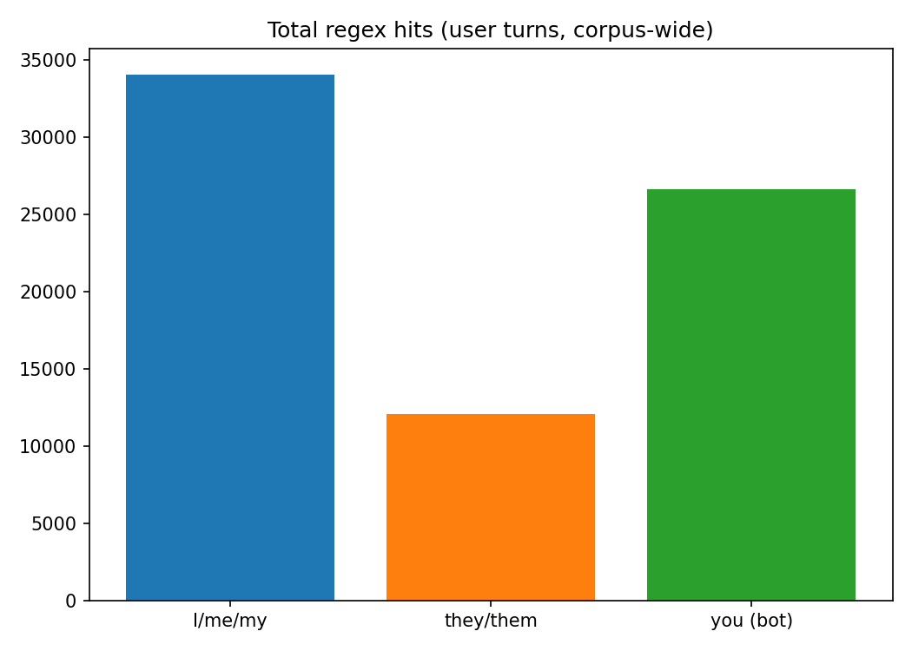

# pronoun_reference

- **Latest batch:** `20260504T214601Z`
- **Dataset:** `data/dataset.parquet`
- **Rows (input / after filters):** 97638 / 48873

## Limitations

ShareChat is built from **publicly shared** conversation links (self-selected threads), and this repo’s default loader slice uses the **`chatgpt`** config only (see `data/dataloader.py`). See `data/DATASET_DESCRIPTION.md` for platform imbalance, PII redaction, and paper limitations.

## Metrics (excerpt)

```json
{
  "mean_hits_i_me_my_per_message": 0.6965195506721502,
  "mean_hits_they_per_message": 0.24706893376711067,
  "mean_hits_you_per_message": 0.5453931618685164,
  "mean_rate_i_among_classified_pronoun_hits": 0.46378401259359653,
  "mean_rate_they_among_classified_pronoun_hits": 0.13155661106633204,
  "mean_rate_you_among_classified_pronoun_hits": 0.4046593763400704,
  "messages_with_any_pronoun_hit": 15976
}
```

## Figures



## Dataset documentation (reference)

<details><summary>DATASET_DESCRIPTION.md (truncated)</summary>

```text
# ShareChat — dataset description for this repository

This note summarizes what **ShareChat** is, how it was built and licensed, headline results from the paper, how we load it in `dataloader.py`, and how that lines up with the exploratory questions in `experiments/initial_eda_2026_05_04/README.md`. Primary sources: [ShareChat on Hugging Face](https://huggingface.co/datasets/tucnguyen/ShareChat), [ShareChat (HTML) on arXiv](https://arxiv.org/html/2512.17843v2), and the companion PDF identifier [arXiv:2512.17843](https://arxiv.org/abs/2512.17843).

## What the data is

ShareChat is a **turn-level, multi-platform corpus** of real user ↔ assistant chat from **five products**: ChatGPT, Perplexity, Grok, Gemini, and Claude. Rows are **individual messages** (not one row per conversation), with shared fields so analyses can aggregate by conversation using keys such as `url` and `turns_count`.

**Collection context.** Conversations come from **publicly shared links** users created on each platform (not private logs). The authors discover URLs in part via **Internet Archive / Wayback Machine** pattern search, then render share pages with **Selenium**, parse HTML into structured records, and run a **PII pipeline** (Microsoft Presidio, spaCy NER, custom rules) across multiple languages. Collection was conducted under **IRB approval** (paper reports #28569). The Hugging Face hub notes the repository is **gated**: you must log in and accept the **ShareChat Dataset License Agreement** before downloading files.

**Temporal and linguistic scope (paper).** Roughly **April 2023 – October 2025** overall; per-platform windows differ (e.g., Grok from Dec 2024 in the appendix table). **101 languages** at the corpus level; **message-level** language detection (lingua-py in the paper) feeds distributions—English dominates, with Japanese as the second-largest slice in the paper’s Figure 2 narrative.

**Scale (paper Table 1).** About **142,808 conversations**, **660,293 turns**, mean **4.62 turns** per conversation. **ChatGPT** dominates volume (~72% of conversations); **Claude** is a small fraction (~0.7%). Token means are **much longer for assistant than user** turns (paper: ~1,115 vs ~135 mean tokens using the Llama-2 tokenizer), reflecting long answers, code, citations, and tool-like outputs.

**Hub updates.** The [dataset card](https://huggingface.co/datasets/tucnguyen/ShareChat) states that as of **5 Apr 2026** an additional **`topic`** column was added per conversation (topic at message/conversation granularity as documented on the card). The card also notes a policy update (Apr 2026) allowing **derivative subsets** with clear attribution to ShareChat.

## Schema and platform-specific fields

**Core columns (all platforms, per HF card and paper):** `platform`, `url`, `turns_count`, `message_index`, `role`, `plain_text`, `detected_language_final` (and, on the hub, **`topic`** after the 2026 update).

**Extra columns vary by platform** (paper Table 2 and §2): e.g., Perplexity/Grok **sources** and citation-like metadata; Grok/Claude **thinking** traces; Claude **code** / **analysis** / **version**; Gemini **model** and timestamps; ChatGPT **model** and **message_create_time** / **create_time**; Perplexity engagement fields such as **views** / **shares**. **Turn-level timestamps** are emphasized for **ChatGPT** and **Grok** in the paper’s temporal analyses.

On Hugging Face the dataset is organized by **config** (one per platform, e.g. `chatgpt`). Our `DataLoader` in `dataloader.py` defaults to **`HF_DEFAULT_CONFIG = "chatgpt"`** and loads `train[:{pct}%]` into local Parquet.

## Key findings from the paper (selected)

1. **Motivation vs prior corpora.** ShareChat argues prior datasets often **homogenize** interaction through a single demo UI, drop **non-text affordances** (citations, thinking blocks), skew toward **shorter threads**, and suffer **observer bias** when users know they are in a study. ShareChat trades that for **self-selection bias** (users choose what to share).

2. **Depth and languages.** Compared to datasets in Table 1 (e.g., LMSYS-Chat-1M, WildChat, ShareGPT), ShareChat emphasizes **longer threads and longer assistant outputs** and **broader language coverage** in their reported statistics.

3. **Toxicity.** Turn-level toxicity (Detoxify and OpenAI moderation, following WildChat-style thresholds) is **lower overall** than WildChat and broadly competitive or better on several comparisons the paper reports. There is a strong **rank correlation** between user-side and model-side toxicity **within** platforms (interpreted as “mirroring”). **Claude** can rank higher on some toxicity metrics in their breakdowns—read in context of small sample size and detection limits.

4. **Topics.** User messages are classified into **24 fine-grained** categories (Llama-3.1-8B-Instruct), rolled up to **seven** high-level groups. **“Seeking information”** dominates (~39.6% of requests in §3.3); **Other/Unknown** is large (~19%); technical help, writing, practical guidance, and self-expression fill much of the rest; **multimedia** is small (~2.4%). Platforms differ in role (e.g., Perplexity vs Claude specialization).

5. **Representative analyses.** **Completeness:** automated pipeline (Qwen3-8B) labels whether intentions are fully, partially, or not met—**ChatGPT and Claude** skew toward **complete** verdicts more than others in their Figure 5 narrative. **Source grounding:** Grok’s sources are **concentrated on X**; Perplexity draws from a **wider mix** (Wikipedia, Reddit, NIH, etc.) and can attach **very many** sources per thread. **Timestamps:** ChatGPT shows **decreasing** model latency over turn index; Grok shows **increasing** latency; user dwell time relates **weakly** to output length at the individual level despite aggregate trends.

6. **Limitations (paper §Limitations).** **Self-selection** (overshare “wins” and interesting threads), **platform imbalance**, **LLM-as-judge** proxies for completeness/t
```

</details>
